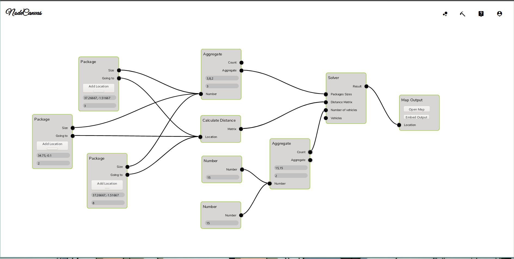
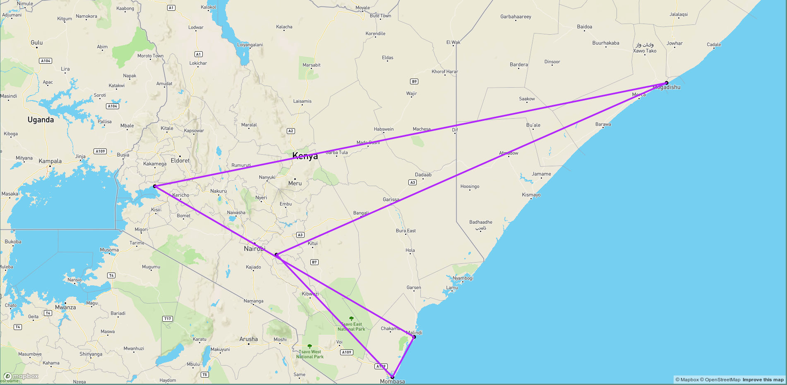

# NodeUI

Streamline the usage of resource planning libraries by substituting custom
code with visual programming.

Currently implemented problem sets are:

* Vehicle Routing
* Shift Scheduling with Preferences

## Example

## Dependencies

The following software must be installed locally and be accessible on
the system's \$PATH:

  * Make
  * NPM and Node
  * A compiler for C++ (g++ and clang++ have both been tested)
  * MongoDB
  * python >= 3.5

Additionally the following is also required:

  * A working internet connection
  * If it is not already present a clone of the [or-tools][1] project from GitHub in the same directory as this project.

## Running

Before running the following steps are necessary:
  1. Run `npm install` in the project's directory
  2. Install the ortools package with python pip (`python -m pip install --user
     ortools`)
  3. Optionally compile one of the or-tools examples to confirm everything
     is working. If this fails then running the application is also likely
     to fail.
  4. Finally run `npm run devStart` and the application will be started 
     on localhost port 3000.

[1]: https://github.com/google/or-tools
